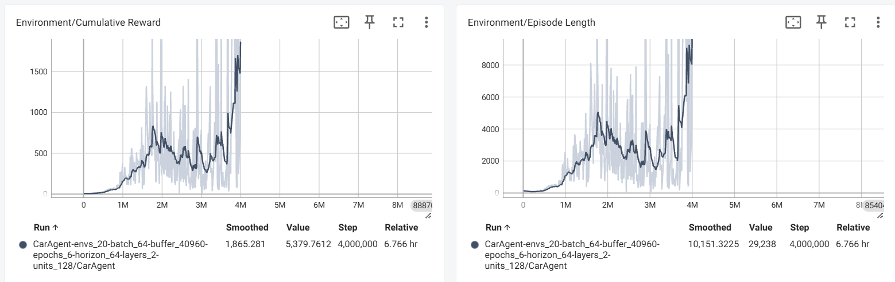

# My RL Projects (2D)

This repository contains a collection of reinforcement learning environments (2d) and agents developed for training and testing simple navigation behaviors.

## Projects

### FlappyPixel

In **FlappyPixel**, the agent must learn to navigate through gaps between pipes by flapping at the right moment. The goal is to stay airborne, avoid obstacles, and score points by passing through pipes.

**Observations**
The agent perceives its environment using:
  * _Ray Perception Sensors_: Detect distances to nearby obstacles, including the pipes, ground, ceiling, and the gaps between pipes.
  * _Vertical Velocity_: The agent also observes its vertical speed via rb.velocity.y, helping it gauge ascent and descent dynamics when deciding whether to flap.

**Reward Mechanics**
* Positive Reward:
  * +0.01: A small reward given at each step the agent stays alive, encouraging sustained flight.
  * +2: For successfully passing through a set of pipes (scoring).
* Negative Reward (Penalties):
  * -1: For colliding with an obstacle or the ground, which also ends the episode.

- 📂 [**Go to project folder**](Examples/FlappyPixel)

  

- 🎥 **Demo:**

  

--

### CarAgent2D
In **CarAgent2D**, the agent controls a 2D car tasked with navigating a track by driving through checkpoints distributed along its layout. The objective is to complete laps efficiently while avoiding collisions with track borders.

**Observations**
The agent learns to navigate the track based on:
  * _Ray Perception Sensors_: Emit rays to detect proximity to track borders (tagged as "Border").
  * _Agent Velocity_: Observes its current velocity in local (car-relative) coordinates to understand its movement dynamics.

**Reward Mechanics**
* Positive Reward:
  * +5: For successfully driving through a checkpoint.
* Negative Reward (Penalties):
  * -1: For colliding with the track border (ends the episode).
  * -0.001: Small time-step penalty to encourage faster completion.

**Learning Dynamics & Exploration Strategy**
To promote generalisation rather than memorisation, the agent is exposed to varied starting conditions. At the beginning of each episode, it is randomly spawned at one of the checkpoint positions. Additionally, it has a 50/50 chance of facing either the standard or reversed direction, training it to complete the track in both orientations. This randomisation encourages robust policy learning that transfers well across different scenarios.

- 📂 [**Go to project folder**](Examples/CarAgent2D)

  

- 🎥 **Demo:**

  

