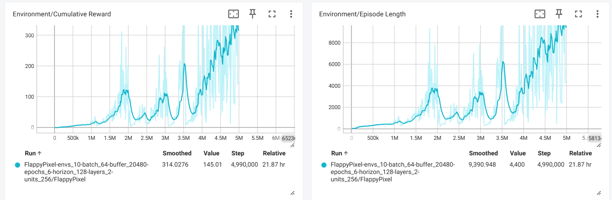

# My RL Projects (2D)

This repository contains a collection of reinforcement learning environments (2d) and agents developed for training and testing simple navigation behaviors.

## Projects

### MoveToGoal

In **FlappyPixel**, the agent must learn to navigate through gaps between pipes by flapping at the right moment. The goal is to stay airborne, avoid obstacles, and score points by passing through pipes.

**Reward Mechanics**
* Positive Reward:
  * +0.01: A small reward given at each step the agent stays alive, encouraging sustained flight.
  * +2: For successfully passing through a set of pipes (scoring).
* Negative Reward (Penalties):
  * -1: For colliding with an obstacle or the ground, which also ends the episode.

- 📂 [**Go to project folder**](ML-Agents/Examples/MoveToGoal)

  

- 🎥 **Demo:**

  

